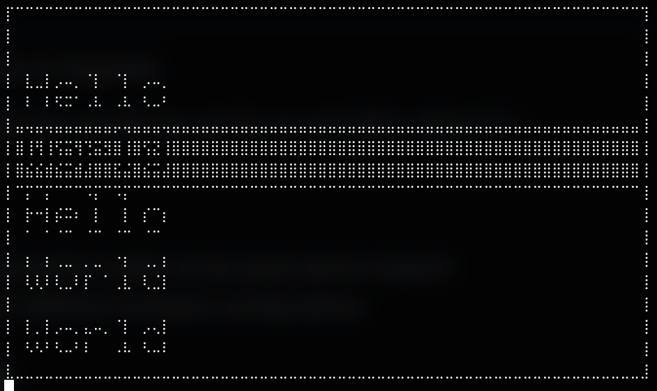

This is a simple clone of Organelle.

It runs in python3, on the console (so can be run over SSH, without X.)

It's not done at all, just prototyping some ideas.



## todo

- SDL2 will probly perform better & has great device support
- add modules for different hardware configurations

## development

```
pip install drawille
```